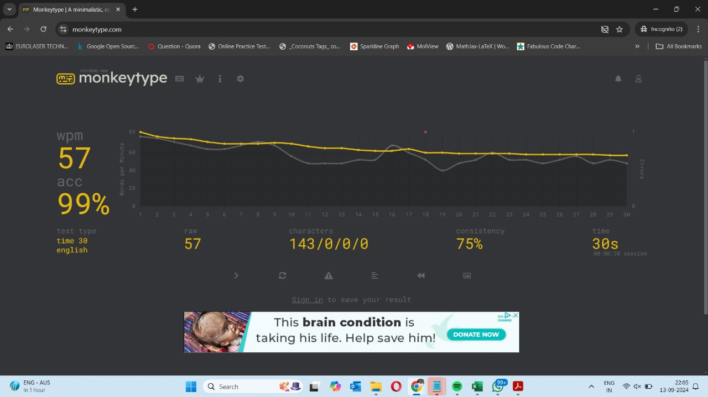

# Touch Typing Progress

## Task Overview

In this task I've been asked to improve typing skills using proper touch typing techniques. The task requires consistent practice to achieve a typing speed of at least **60 Words Per Minute (WPM)** with a minimum accuracy of **95%** on a 30-second typing test on **Monkeytype**.

## Progress

- **Platform**: Typing.com for guided lessons and Monkeytype for WPM testing.
- **Daily Practice**: 5-10 minutes of touch typing practice per day.
- **Current WPM**: 57 WPM
- **Current Accuracy**: 99%

## Tools Used

- [Typing.com](https://www.typing.com) - Guided typing lessons.
- [Monkeytype](https://www.monkeytype.com) - Typing speed and accuracy tests.

## Goal Achievement

I have done this task with **57 WPM** with **99% accuracy** on Monkeytype in a 30-second test.

