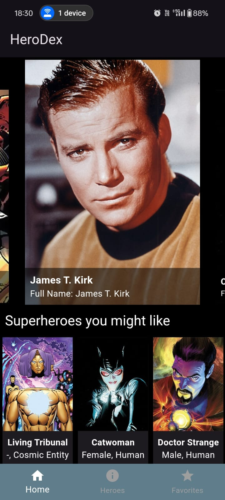
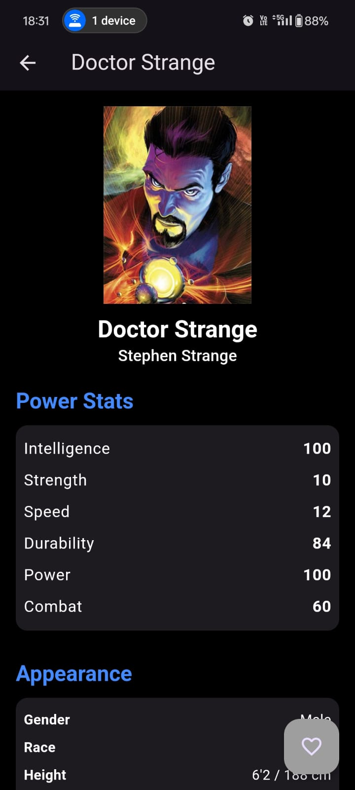
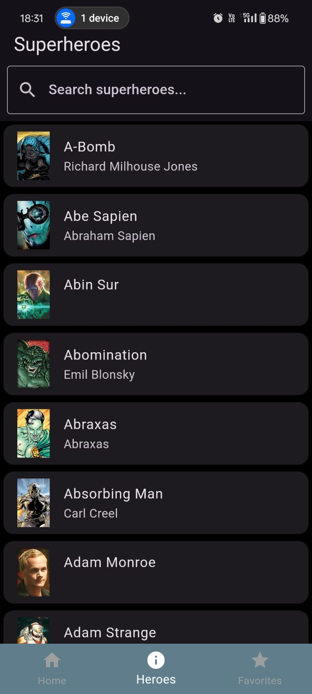
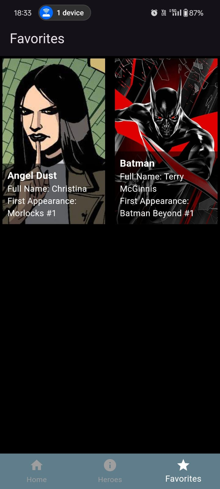

# HeroDex 

Build a user-friendly superhero encyclopaedia app with Flutter and vanquish Dr.Dulldev’s schemes forever! This powerful framework by Google allows you to create beautiful and functional mobile applications for both Android and iOS.

You can use `app-release.apk` to experience the UI on your mobile

## Features

- **Home Page**: Displays random superheroes and a list of favorites.
- **Superhero List**: Browse through all available superheroes.
- **Favorites**: Save your favorite superheroes for quick access.
- **Detailed Profiles**: View detailed information on each superhero, including power stats, appearance, biography, work, and connections.
- **Search**: Quickly find your favorite heroes using the search function.
- **Dark Mode**: The app uses a sleek dark theme to make the experience more immersive.

## Screenshots

    
    
    
    

